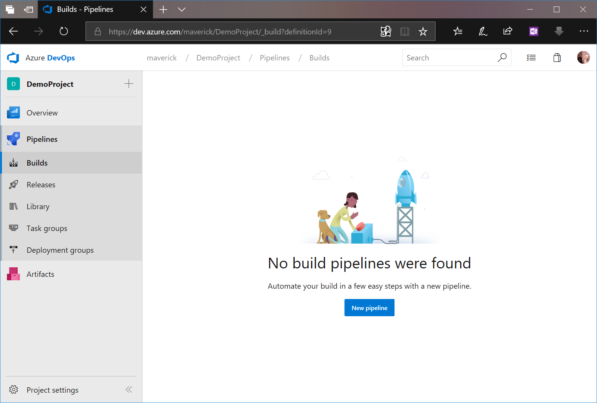

# Create your first build pipeline

This is a step-by-step guide to using Azure Pipelines to build a GitHub repository.

## Prerequisites

* You need an Azure DevOps organization. If you don't have one, you can [create one for free](https://dev.azure.com/). 
* You need a GitHub account, where you can create a repository. If you don't have one, you can [create one for free](https://github.com/join). 

## Get the sample code

For this tutorial we will be referencing an ASP.NET Core sample application from Microsoft Docs. If you haven't already signed up to GitHub, please do so now and then signin. After you've signed in, navigate to the following repository and click on he **fork** button to add it to your GitHub repository:

```
 https://github.com/MicrosoftDocs/pipelines-dotnet-core
```

## Get your first build

1. Sign in to your Azure DevOps organization and navigate to your project.

1. In your project, navigate to the **Pipelines** page. Then choose **New pipeline**.

   

1. The new pipeline workflow will first ask you where your source code is. It's also at this point where you choose to either use the default YAML build definition or the traditional UI designer. YAML is the new default, so make sure you click on the link `Use the visual designer` to create your pipeline.

   

1. Now select **GitHub** as your source. You might be redirected to GitHub to sign in. Enter your GitHub credentials. When you're redirected back to Azure Pipelines, select the `pipelines-dotnet-core` repository followed by the **Continue** button.

   

1. Now you will need to select template or start with an empty job. 

   

1. There are many build templates available to choose from. Go to the search file and type `.net core`. Select the `ASP.NET Core` template.

   

1. Let's now enable Continuous Integration so that whenever your code changes are committed and push up, a build is automatically kicked off. Click on the **Triggers** tab and check `Enable continuous integration`.

1. Now click on the **Save & queue** button. You will then be prompted to save your build and set properties for your build. Since this is a .NET Core application, it can build on any host. I will go and change it to `Hosted VS2017` and then click on the **Save a& queue** to trigger the build.

   

   

1. Now wait for the build to finish. When the build is complete, you will find all build related details like logs, artifacts, test status, etc.

   

Congratulations you've setup your first Azure Pipeline!

## Get the status badge

1. In Azure Pipelines, go to the Build page to view the list of pipelines.

1. Select the pipeline that was created for you.

1. In the context menu for the pipeline, select **Status badge**.

   

1. Copy the sample **Markdown** from the status badge panel.

## Add the status badge to your repository

Take the following steps in GitHub:

1. Go to your GitHub repository online and in the root of your repository, inspect the `README.md` file. 

1. Now choose **Edit**.

1. Paste the status badge Markdown that you copied in the previous section at the beginning of the `README.md` file.

1. Commit the change to the master branch.

1. Notice that the status badge appears in the description of your repository.

Back in Azure Pipelines, observe that a new build is queued. Its status might be either not started or running.

## Next steps

You've just learned the basics of using Azure Pipelines. Now you're ready to further configure your pipeline to run tests, publish test results, create container images, or even deploy the app to a cloud service.