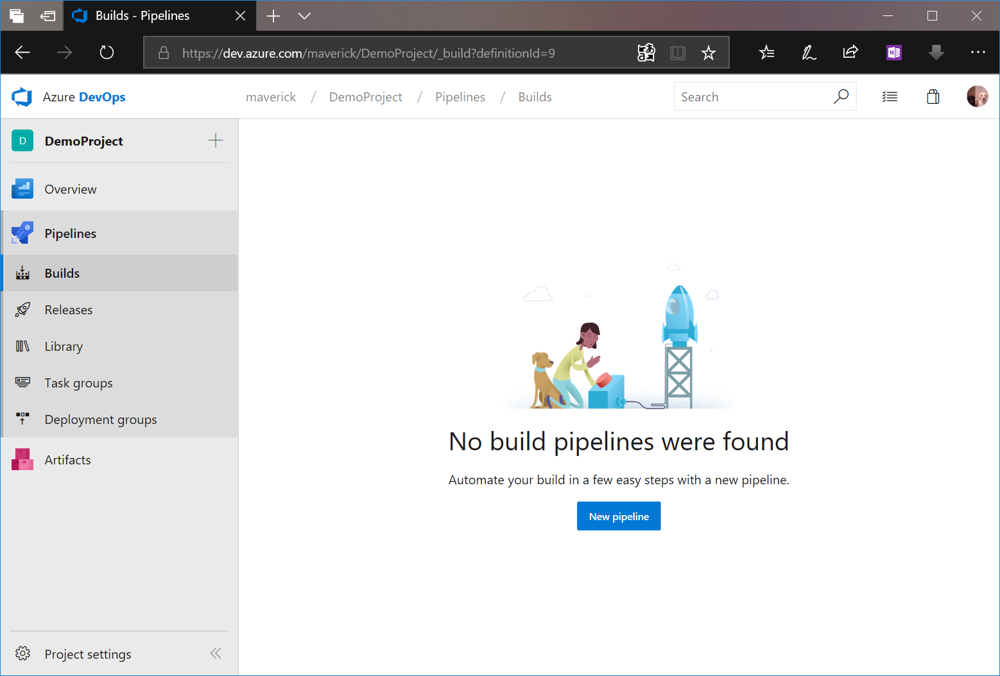
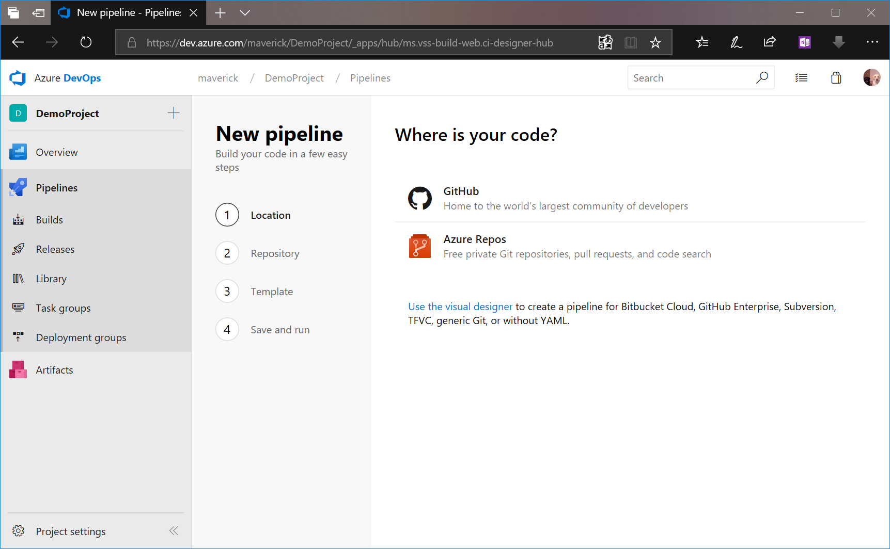
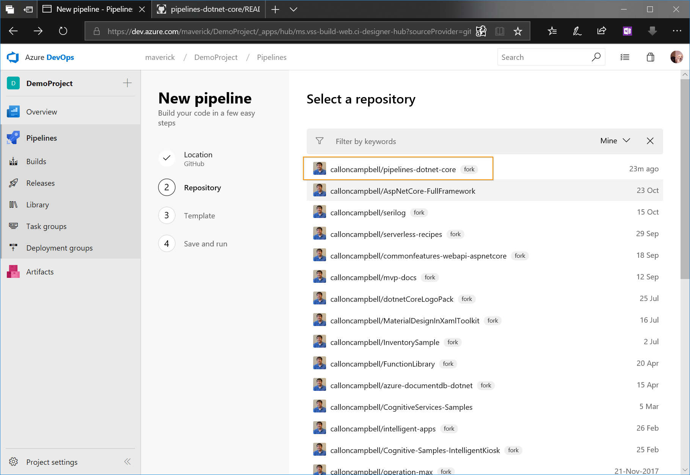
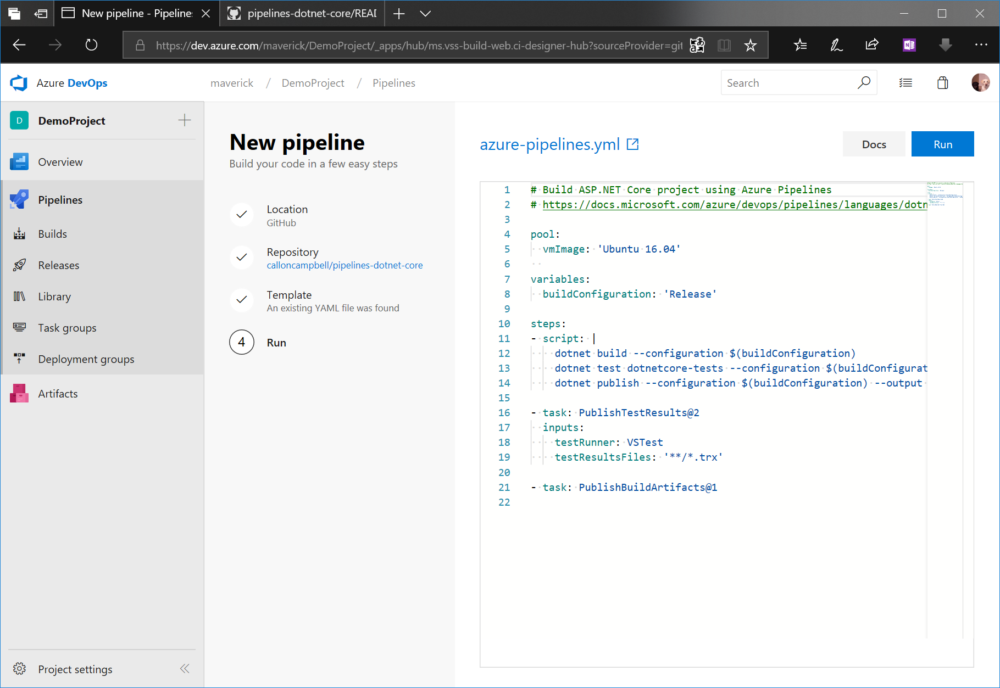

# Create your first build pipeline with YAML

This is a step-by-step guide to using Azure Pipelines to build a GitHub repository using YAML.

## Prerequisites

* You need an Azure DevOps organization. If you don't have one, you can [create one for free](https://dev.azure.com/). 
* You need a GitHub account, where you can create a repository. If you don't have one, you can [create one for free](https://github.com/join). 

## Get the sample code

For this tutorial we will be referencing an ASP.NET Core sample application from Microsoft Docs. If you haven't already signed up to GitHub, please do so now and then signin. After you've signed in, navigate to the following repository and click on he **fork** button to add it to your GitHub repository:

```
 https://github.com/MicrosoftDocs/pipelines-dotnet-core
```

## Get your first build

1. Sign in to your Azure DevOps organization and navigate to your project.

1. In your project, navigate to the **Pipelines** page. Then choose **New pipeline**.

   

1. Walk through the steps of the wizard by first selecting GitHub as the location of your source code.

   

1. For the second step, choose to Authorize with OAuth by selecting Authorize. You might be redirected to GitHub to sign in. Enter your GitHub credentials.

1. When you're redirected back to Azure Pipelines, select the `pipelines-dotnet-core` repository.

1. For the third step, Azure Pipelines analyzes the code in your repository. If your repository already contains an `azure-pipelines.yml` file, which is the case for all sample repositories, then this step is skipped. Otherwise Azure Pipelines recommends a starter template based on the code in your repository.

   

1. In the final step, you're shown the YAML file that will be used.

   

1. Select **Save and run**. Choose the option to **Commit directly to the master branch**.

1. The YAML file is now pushed to your GitHub repository, and a new build is automatically started.

1. Wait for the build to finish.

Congratulations you've setup your first Azure Pipeline using YAML!

## Next steps

You've just learned the basics of using Azure Pipelines using YAML. Now you're ready to further configure your pipeline to run tests, publish test results, create container images, or even deploy the app to a cloud service.

## Reference

* [YAML schema reference](https://docs.microsoft.com/en-us/azure/devops/pipelines/yaml-schema)