# Create your first pipeline release

This is a step-by-step guide to using Azure Pipelines to setup a release for continuous deployment to an Azure App Service.

## Prerequisites

* You need an Azure DevOps organization. If you don't have one, you can [create one for free](https://dev.azure.com/). 
* You need an Azure account. If you don't have one, you can [create one for free](https://azure.microsoft.com/en-ca/free/). 

## Create your first pipeline release

1. Go to your build details and click on gthe **Release** button to define a new release. 

   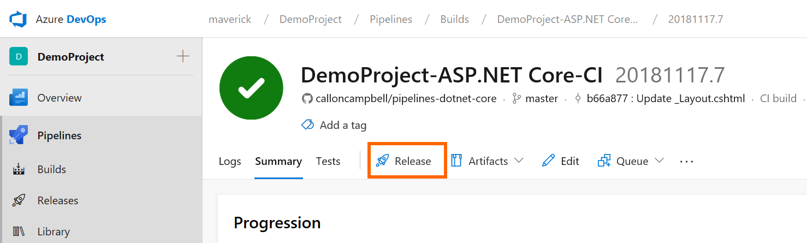

1. Then from the list of templates choose **Azure App Service deployment** since this is where we will be deploying out application. Then rename **Stage 1** to **Dev** and click on the X to close the pane.

   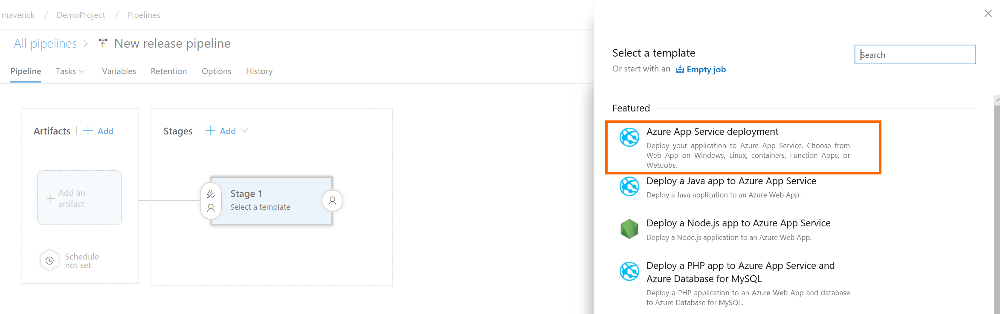

1. Now we want to select our build artifact that we want to deploy. Click on the **Add an artifact** button as shown below.

   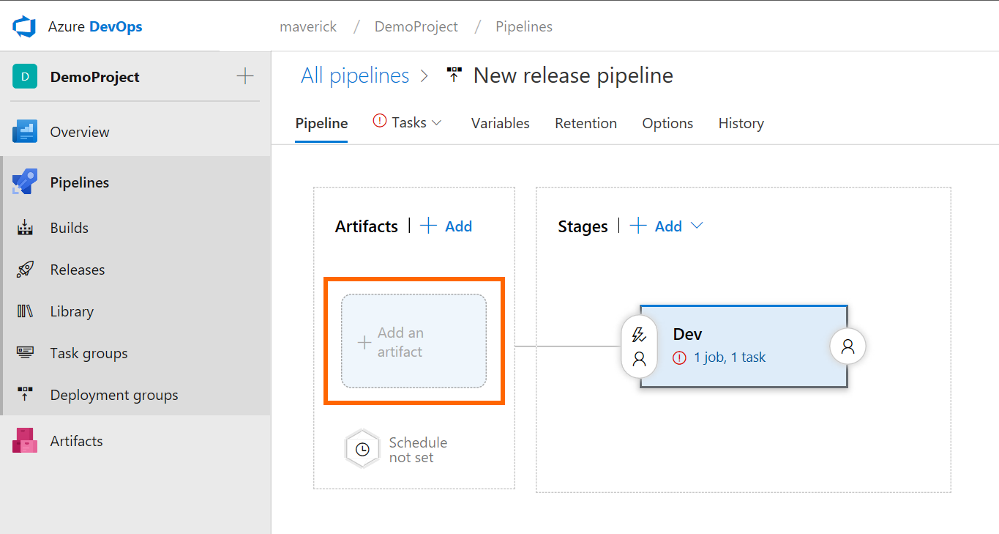

1. Now select your project, the source (build pipeline), and the default version. Then click on the **Add** button.

   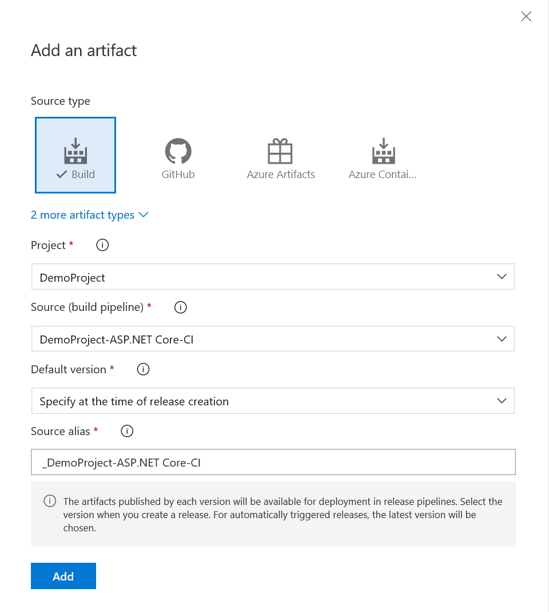

1. Now we need to finish up our release pipeline by adding in the deployment criteria for where our build is being deployed. Go ahead and click on your Dev stage **1 job, 1 task** link.

   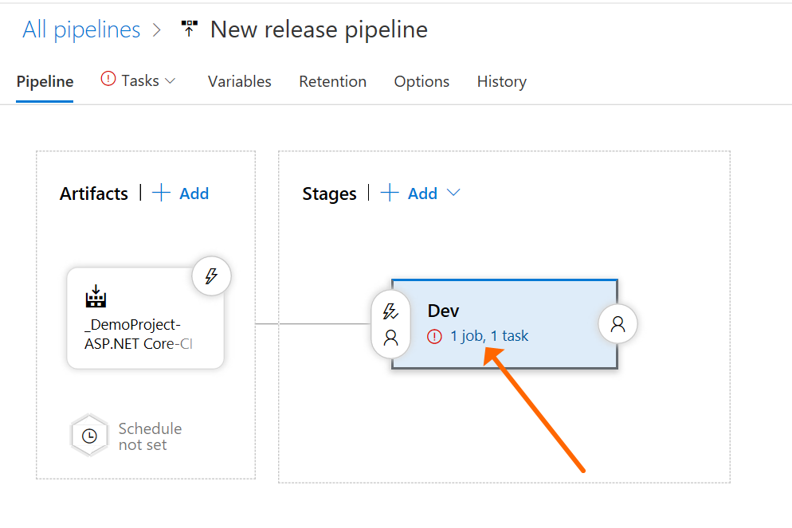

1. Now we want to Configure your Azure subscription and App service name to use for deployment. Please go ahead and select your subscription and app service name and then click on **Run on agent** task.

   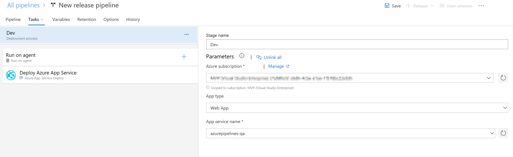

1. The **Run on agent** task defines the agent variables and which host to run on. I've gone and selected the **Hosted VS2017** agent pool. Since this is a ASP.NET Core app, you can deploy it anywhere. 

   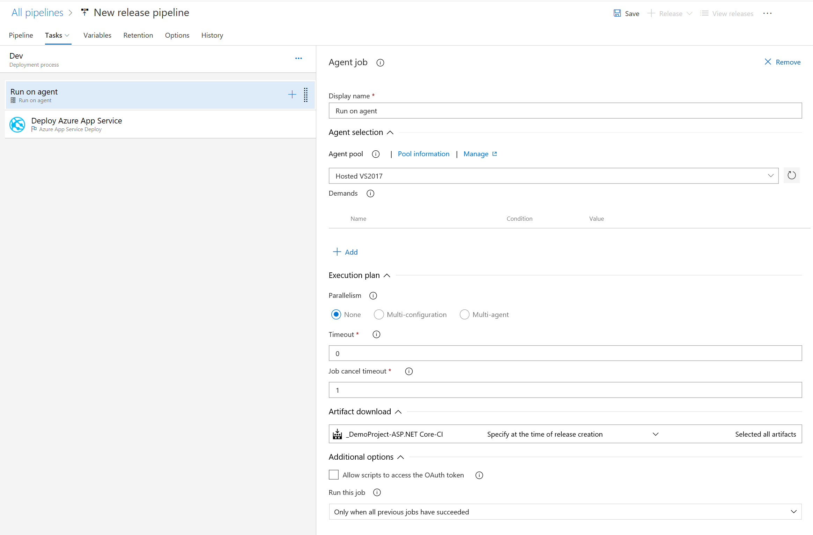

1. Finally review the **Deploy Azure App Service** task. For now there is nothing to change.

   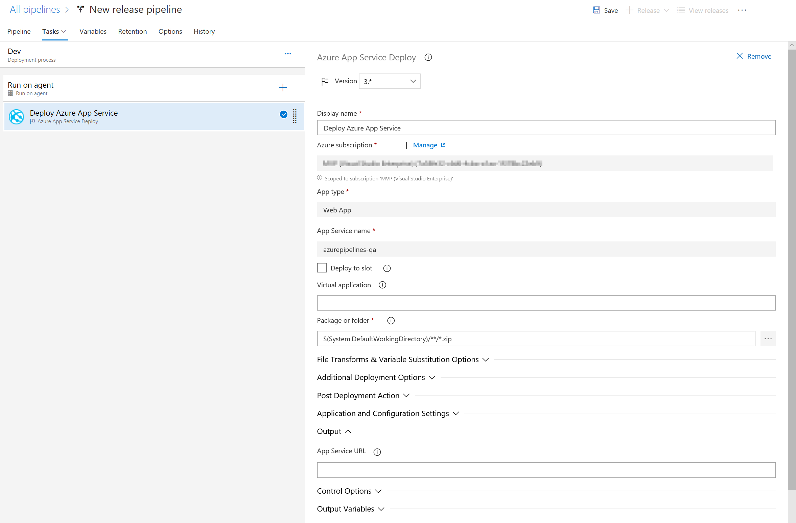

1.  Click on the **Save**  button to make sure all changes are saved.

## Create your release

Now that our release pipeline is setup let's create our release. 

1. From the **releases** view, select your release pipeline we just created and then click on the **Create a release** button.

   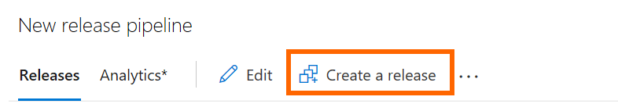

1. Then select the stages to deploy to and which version to use. If you want the version to always be the latest go back and edit your release pipeline and change the artifacts source version property to latest.

   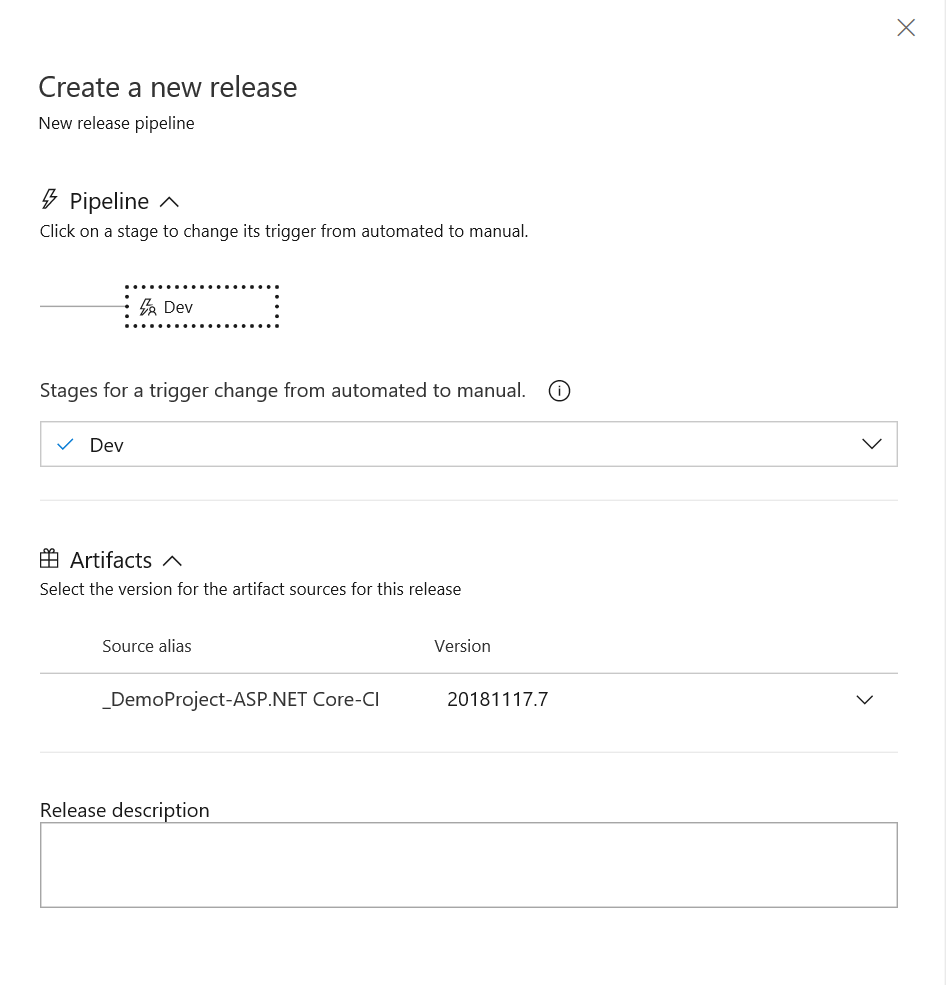

1. Since this release was manually triggered, you have to click on the **Deploy** button to initiate the deployment.

   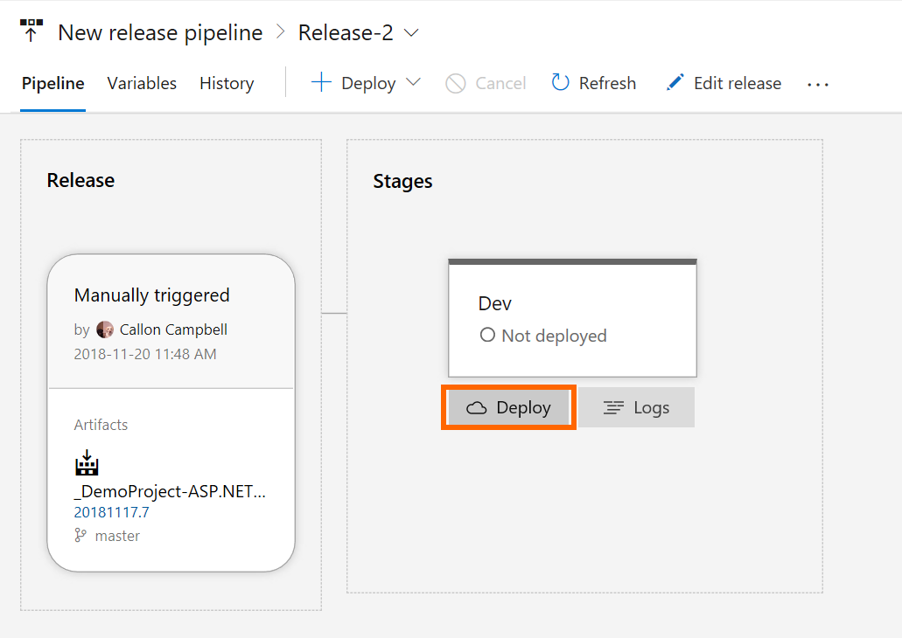

1. You will now see a deployment status for the selected stage and within a couple minutes the release should have succeeded.

   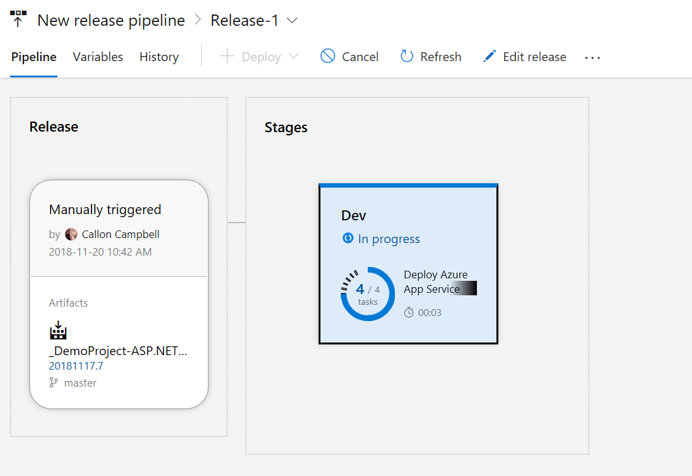

   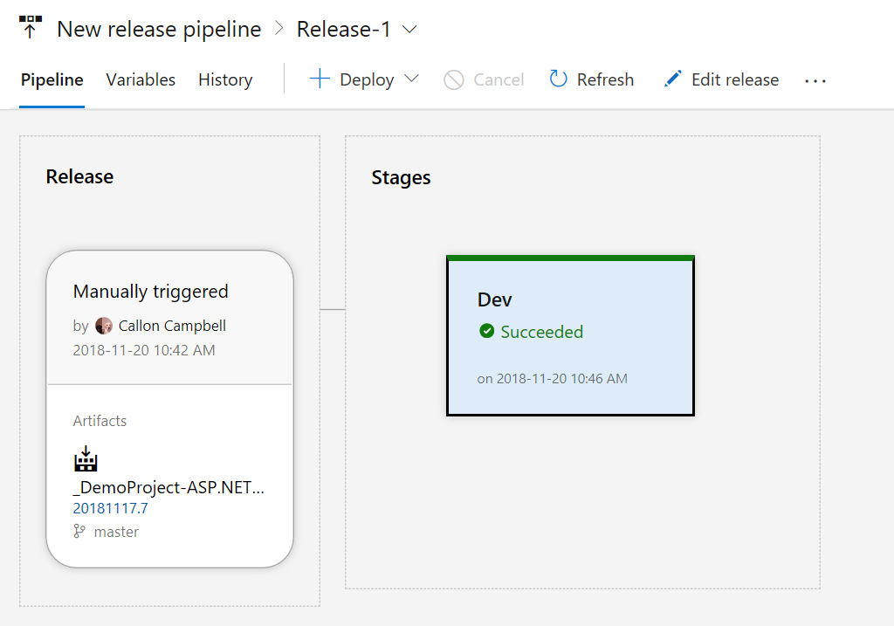

1. After the release is complete, navigate to your site running in Azure using the Web App URL `http://{web_app_name}.azurewebsites.net`, and verify its contents.

## Enable continuous deployment for your release

Now that our release pipeline is defined we want to run a deployment everytime a successful build has run. We do this by activating the continuous deployment trigger.

1. Edit your release and then click on the flash symbol inside of the circle for your artifact. Then on the right pane enable the **Continuous deployment trigger** as shown below.

   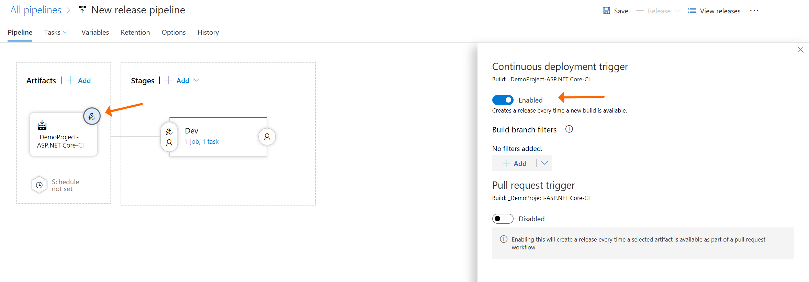

1. Now click on the **Save** button. The next time you have a successful build, it will automatically be deployed to this environment.

## Next steps

Here you've learned how to setup a continuous deployment so that whenever a new build artifact is available, a new release will automatically be created and deployed to your Dev environment.

Now you're ready to start exploring release approvals, gates and pre-deployment and post deployment conditions. You may also want to try deploying your app to another hosted agent like on Linux.