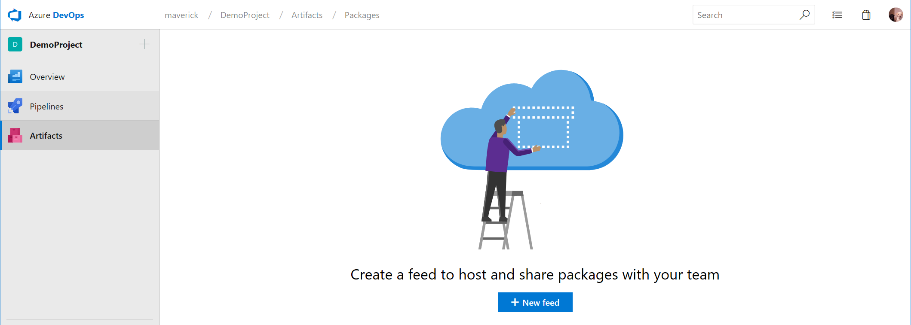

# Create your first artifact feed

This is a step-by-step guide to using Azure Artifacts to setup a NuGet package feed for your organization.

Azure Artifacts is an extension to Azure DevOps Services and Team Foundation Server (TFS). 

Azure Artifacts introduces the concept of multiple feeds that can be used to organize and control access to your packages. If you're familiar with using packages from NuGet.org or npmjs, you can think of those places each as a single feed. 

A note on terminology: you may also have heard feeds called package repositories or package sources, especially if you're an npm or Maven user.

## Prerequisites

* You need an Azure DevOps organization. If you don't have one, you can [create one for free](https://dev.azure.com/). 

## License artifacts

### Assign Artifacts in Azure DevOps Services

Each organization gets five (5) free licenses. If you need more than 5 licenses, go to the **Marketplace** page for Azure Artifacts and select **Get**. Click Buy and purchase the additional licenses you need. 

You will need to assign your licenses by following the instructions below:

1. Go to your organization, select Admin settings in the bottom left of the UX.

1. Select Users.

1. Select the user or users you wish to assign the Azure Artifacts extension to, and choose Manage extensions.

1. If selecting multiple users, click Assign extensions and choose the Azure Artifacts extension. If only selecting one user, check the Azure 
Artifacts box under Extensions and select Save changes. 

If you have a Visual Studio Enterprise license, you already have access to Azure Artifacts and don't need to be assigned a license, just ensure that you've been assigned the "Visual Studio Enterprise" access level.

## Create your feed

With Azure Artifacts you can add fully integrated package management to your continuous integration/continuous delivery (CI/CD) pipelines with a single click. 

1. To get started, go to the **Artifacts** section from the left navigation menu and then click on the **New feed** button.

   

1. Give your feed a name, set visibility and whether to include public sources.

   

1. Now that we have our very own NuGet feed, you need to connect to it from Visual Studio. Click on **Connect to feed**.

   

1. Since we're working with NuGet, select NuGet from the left navigation and then copy the **Package source URL**. You can actually connect to specific release views. Change the **All packages** dropdown to another value to see the URL for that particular feed.

   

1. Now go to Visual Studio and go to **Tools** -> **Options** and then t open up the Package Management 

   

### Keep your artifacts organized

Create and share Maven, npm, and NuGet packages from public and private sources with teams of any size. And there is no need to store binaries in Git – simply store them using Universal Packages.

### Protect your packages

Keep every public source package you use—including packages from npmjs and nuget.org—safe in your feed where only you can delete it, and where it’s backed by the enterprise-grade Azure SLA.

## Next steps

Here you've learned how to setup an artifacts feed for your organization, and learned about upstream sources, and how you can use release views to mark your packages with quality of change.

Now you're ready to start exploring other types of packages like **npm**, **Maven**, and **Universal Packages** and how you can incorporate them into your DevOps process.